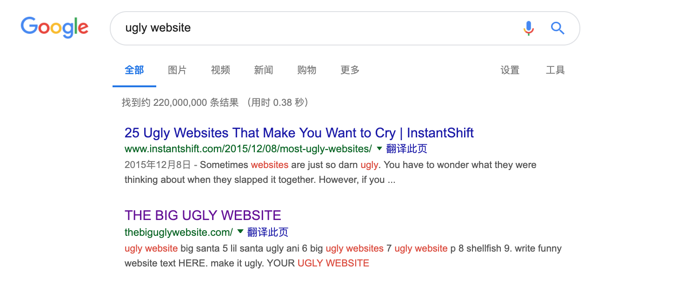
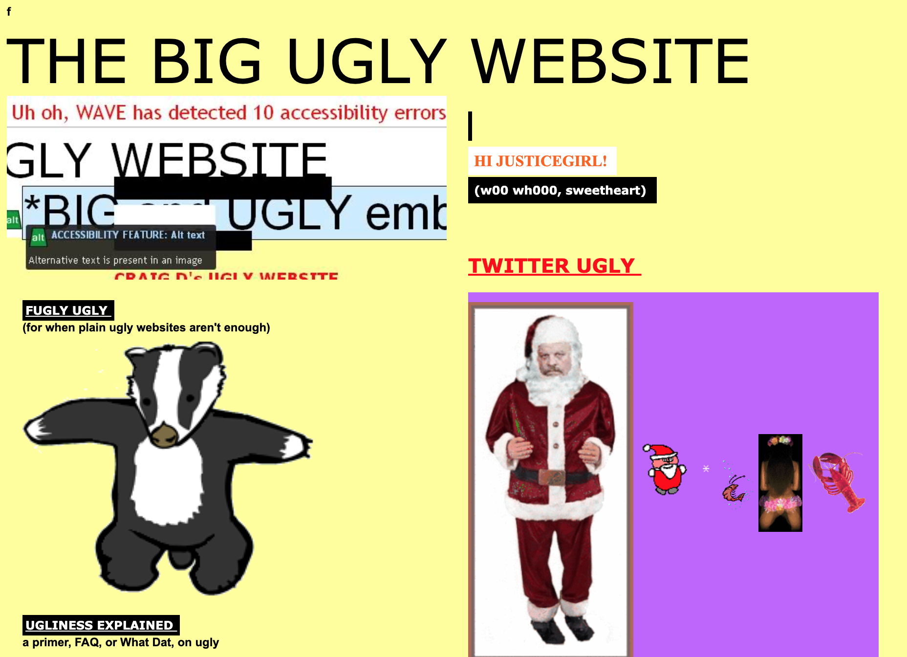
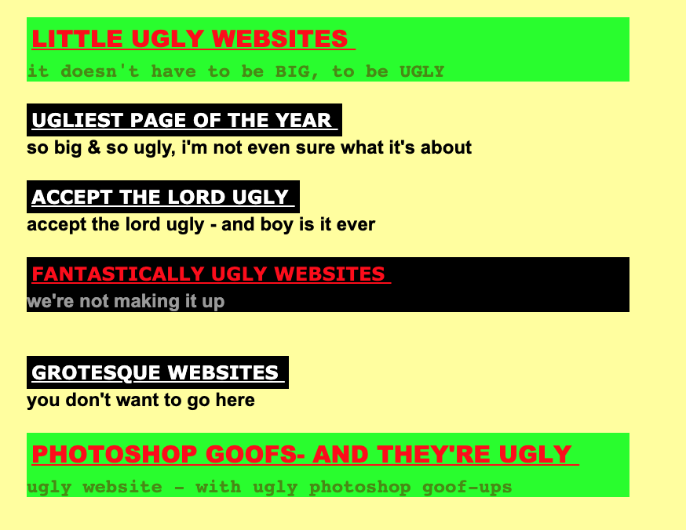

# 3.How did you find it?
---

1. You go to [google](http://www.google.com).
1. Typing  *"ugly website"*
1. The second result will be our perfect website.

---
Let's have a look at our website! 
---

# 4.Why does this website need an update / complete makeover ?
---
1. Extremely _messy_. Is it appropriate to use "extreme" in a professional context?
1. Ugly color choice. Shouldn't we say it's unpleasant to look at?
*Red* and Green?

1. Font size is too small.

